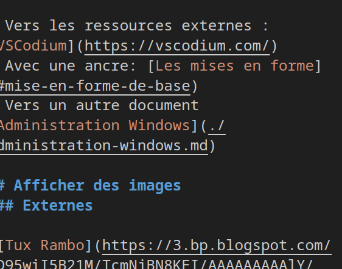

# Apprentissage du Markdown

- [Apprentissage du Markdown](#apprentissage-du-markdown)
  - [Mise en forme du texte](#mise-en-forme-du-texte)
- [Texte simple](#texte-simple)
  - [Mise en forme de base](#mise-en-forme-de-base)
  - [Formatage de code / commandes](#formatage-de-code--commandes)
  - [Les listes](#les-listes)
    - [Non ordonnées](#non-ordonnées)
    - [Ordonnées](#ordonnées)
  - [Les liens](#les-liens)
  - [Afficher des images](#afficher-des-images)
    - [Externes](#externes)
    - [Interne](#interne)
  - [Les tableaux](#les-tableaux)


## Mise en forme du texte

# Texte simple

On peut écrire du texte au kilomètre.
Les lignes continues ne créent pas de saut de ligne en restitution.

Il faut une ligne vide pour en avoir un.

## Mise en forme de base

On peut écrire **en gras**, *en italique*, on peut ~~barrer du texte~~.

Le soulignement est possible, mais moins intuitif : <span style="text-decoration: underline;">Texte à souligner</span>

> Ceci est une citation
> Qui est restituée en une ligne
>
> Avec un saut de ligne

## Formatage de code / commandes

Avec la commande `ls`, on liste les fichiers. les options `-h` permettent d'avoir un rendu plus lisible, le `-l` plus complet.

```bash
exempleDeFonction () {
  mkdir -p $1
  cd $1
}
```

## Les listes

### Non ordonnées

Les options de `ls` :

- `-h` : human readable
    ```
    achaussier $ ls -lh /tmp/demo-mark/
    total 4.0K
    -rw-rw-r-- 1 achaussier achaussier 322 Jan  5 10:27 administration-linux.md
    ```
- `l` : long
    - sous liste possible 
- ...

### Ordonnées

Configuration de disques:

1. Création d'un disque
2. Partitionnement
3. Formattage
   1. pwet
4. ...

## Les liens

- Vers les ressources externes : [VSCodium](https://vscodium.com/)
- Avec une ancre: [Les mises en forme](#mise-en-forme-de-base)
- Vers un autre document [Administration Windows](./administration-windows.md)

## Afficher des images
### Externes


### Interne



- Foobar
    


## Les tableaux

| Commande | Description |
| --- | --- |
| `ls` | Liste les fichiers |
| `cat` | Affiche un contenu |